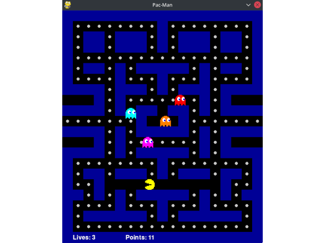

# Multi-threaded Pac-Man in Python

## Screenshot

## Threads

- Main game thread - starts Pac-Man and ghost threads, displays the board and characters, reads user input,
- Pac-Man thread - updates Pac-Man state,
- 4 ghost threads - update ghost states.

## Mutexes:

- `_life_lock` in `Game` class - prevents race condition when decreasing life count,
- `_point_lock` in  `Game` class - prevents race condition when increasing point count,
- `_turn_lock` in `GameCharacter` class - prevents race condition while processing pressed keyboard keys or characters colliding with walls.
